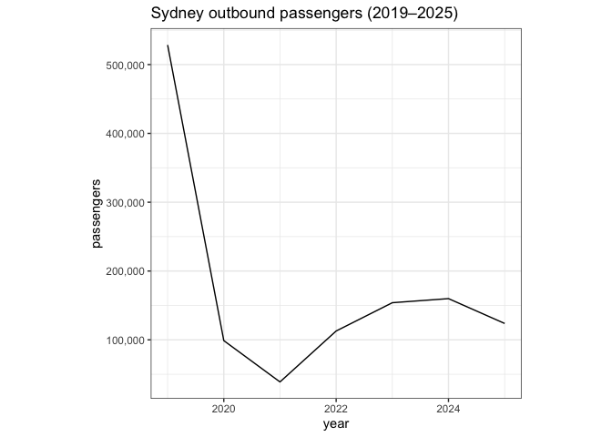

### *Australian aviation activity & economic indicators*

**auflights** is an R *data package* containing a collection of
Australian aviation datasets, including domestic routes, international
airline activity, air fares, CPI, and exchange rates. It is designed for
**teaching**, **exploratory analysis** and **visualisation**.

------------------------------------------------------------------------

## Installation

``` r
# install directly from GitHub:
remotes::install_github("Tinarj/auflights")
```

------------------------------------------------------------------------

## Included datasets

The package provides the following cleaned & documented datasets:

| Dataset               | Description                                                                                       |
|-----------------------|---------------------------------------------------------------------------------------------------|
| **au_dom_routes**     | Monthly domestic city-pair flights, seats, and passengers (2016–2025) from BITRE.                 |
| **au_int_airlines**   | Monthly international flights & passengers inbound/outbound by city-pair and airline (2016–2025). |
| **au_int_routes**     | Disaggregated international city-pair routing from BITRE.                                         |
| **airfares_domestic** | Domestic airfare indices (business & economy).                                                    |
| **cpi**               | Consumer Price Index (ABS).                                                                       |
| **exchange_rates**    | RBA exchange rate historical series.                                                              |

Raw Excel files are stored in `data-raw/original/`, and cleaned `.rda`
files are stored in `data/`.

------------------------------------------------------------------------

## Example: domestic route analysis

``` r
library(auflights)
library(dplyr)
library(ggplot2)

au_dom_routes |>
  filter(origin_city == "Sydney", year >= 2019) |>
  group_by(year) |>
  summarise(passengers = sum(n_passengers, na.rm = TRUE)) |>
  ggplot(aes(year, passengers)) +
  geom_line() +
  labs(title = "Sydney outbound passengers (2019–2025)") +
  scale_y_continuous(labels = scales::label_comma()) +
  theme_bw() +
  theme(aspect.ratio = 1)
```



------------------------------------------------------------------------

## Example: international inbound passengers by country

``` r
in_passengers <- au_int_airlines |>
  group_by(country) |>
  summarise(inbound = sum(n_passengers_in, na.rm = TRUE)) |>
  arrange(desc(inbound)) |> 
  slice_head(n = 10)
kableExtra::kable(in_passengers)
```

| country              |  inbound |
|:---------------------|---------:|
| New Zealand          | 27249699 |
| Singapore            | 21602843 |
| United Arab Emirates | 13327142 |
| Indonesia            | 12132675 |
| USA                  | 10773639 |
| China                | 10316992 |
| Malaysia             |  9100647 |
| Hong Kong (SAR)      |  8304588 |
| Japan                |  5528996 |
| Thailand             |  5424765 |

## Data sources

- **BITRE – Bureau of Infrastructure and Transport Research Economics**
  Domestic & International Airline Activity <https://www.bitre.gov.au>

- **ABS – Australian Bureau of Statistics** CPI indices
  <https://www.abs.gov.au>

- **Reserve Bank of Australia (RBA)** Exchange rates (F11 series)
  <https://www.rba.gov.au/statistics/>

All data is public and reproducible.

------------------------------------------------------------------------

## Contributions

Feel free to open issues or pull requests. Feedback and extensions are
always welcome!
